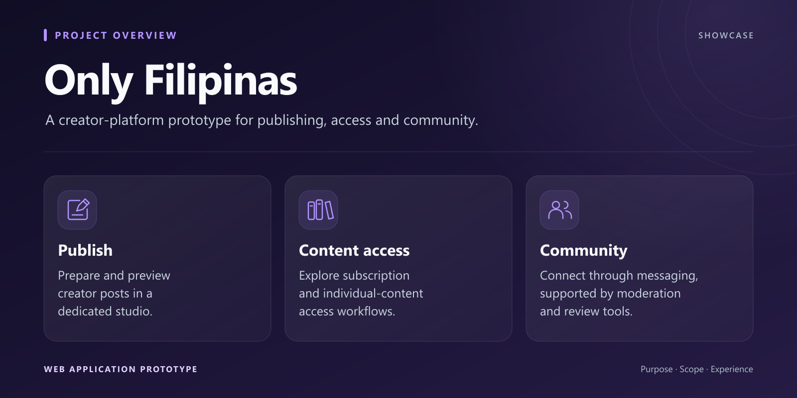
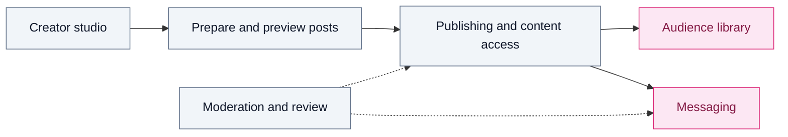

*Concept illustration created for this showcase.*

<h1>Only Filipinas</h1>

<strong>A creator-platform prototype for publishing, access and community.</strong>

  
  
  
  

## Purpose

Only Filipinas brings creator publishing, content access and audience interactions into a single web-application prototype. It explores the workflows on both sides of a creator platform: managing a publication and finding, accessing and organizing content.

## Features

- Creator studio with publishing tools and post previews.
- Subscription and individual-content access workflows.
- A digital library for organizing accessible content.
- Messaging with media attachments.
- Moderation and administrative review tools.

## Visual overview

## High-level workflow

The prototype connects publishing, access management and communication, with administrative workflows supporting moderation and review.

## Stack

Python and FastAPI provide the application backend, with Jinja2 templates and SQLite for local use. The project also includes optional PostgreSQL support and Docker packaging.

## Development status

Local prototype covering creator, subscriber and moderation workflows. Public launch depends on connecting and validating external services and operational processes.

## About this repository

This repository is a public showcase. Only presentation material is published; source code and private data remain private.

**Last showcase review:** 2026-09-12 (Europe/Paris).
