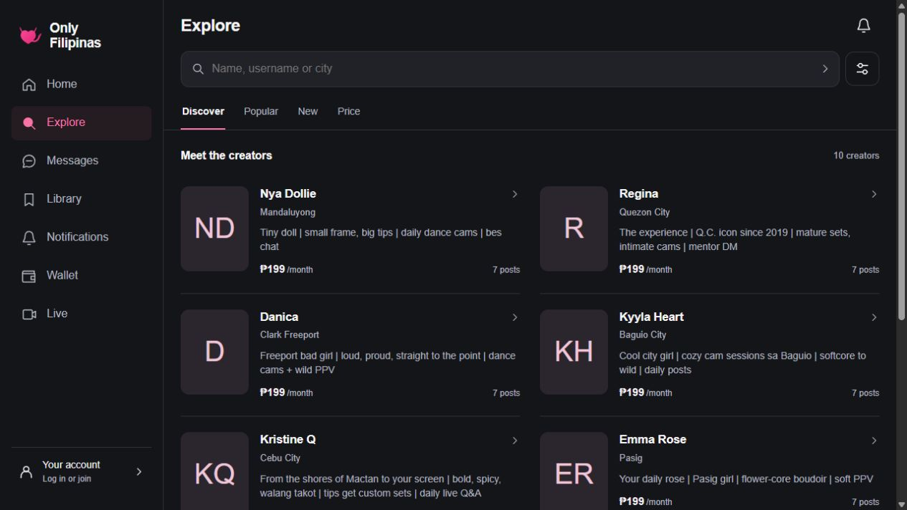
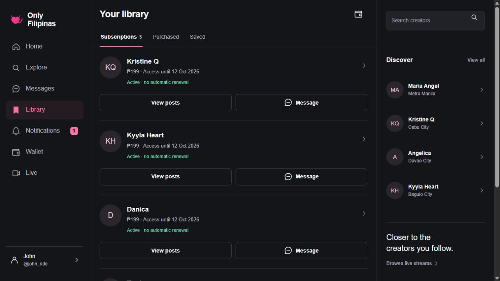
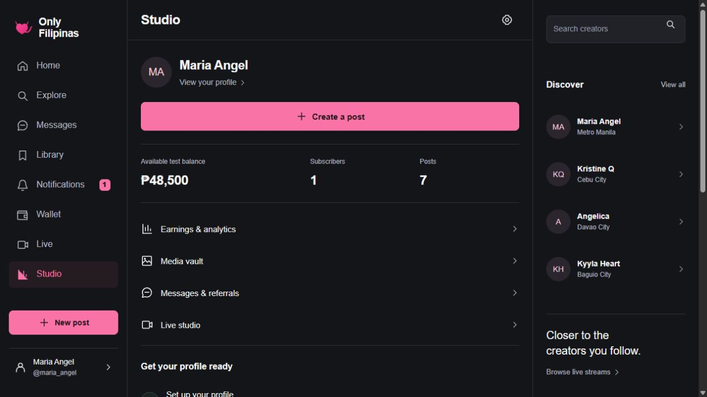
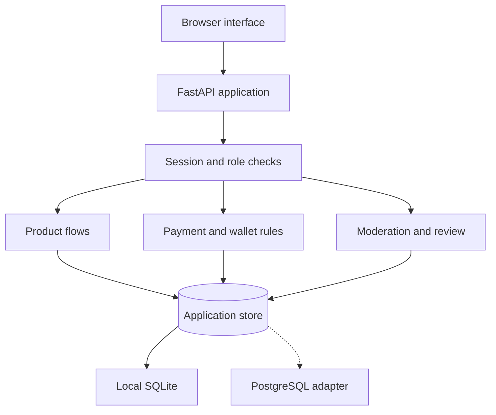
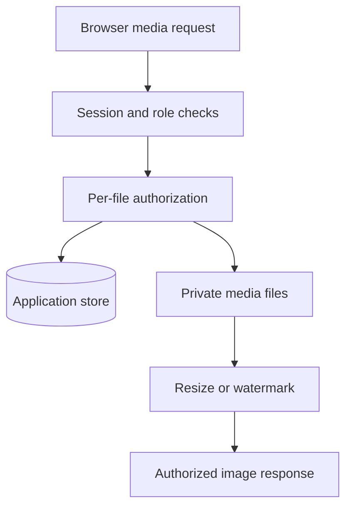
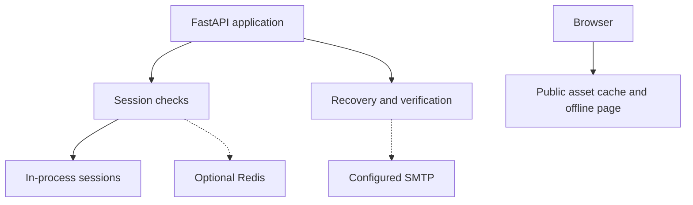

# Only Filipinas

### A creator platform from discovery to publishing, access and conversation

A server-rendered web application with distinct **fan, creator and administrator experiences**.
Fans can discover creators and organize their content; creators can publish, manage media and
communicate with their audience; administrators have moderation and review workflows.

*Actual Explore screen captured on 12 September 2026, using the application's built-in fictional creators and native initials placeholders.*

These screenshots show the unchanged application running in an isolated local environment with
its built-in demo data. Creator profiles, subscriptions, post counts and balances are fictional
examples. Original creator media was excluded; the captures do not represent user traction or revenue.

## Explore creators without losing the search context

The discovery experience combines a text search with location, subscription budget and sorting.
Changing between Discover, Popular, New and Price preserves the active filters. Results expose
the creator's profile, location, description, subscription price and post count, with explicit
empty states when no result matches.

The application has dedicated Home, Explore, Inbox, Library and Account or Studio navigation,
with layouts designed for narrow screens as well as desktop use.

## A library that explains access

The library separates **subscriptions**, **individual purchases** and **saved posts**. Subscription
entries show the price, access end date and whether access is active or expired.

The current subscription model grants access for a fixed period and does not renew automatically.
Ending a subscription removes subscriber access immediately; separately purchased posts remain
available. The interface explains those consequences before confirmation.

*Actual Library screen for a built-in fictional fan account. The subscription entries and access dates come from the demo seed; no subscription was purchased or cancelled for this capture.*

## Publishing and the creator studio

The studio brings together profile setup, pricing, publishing, recent posts and links to the
creator's media vault, analytics, campaigns and live-studio preparation.

- **Compose with a preview:** add and remove multiple image or video attachments before publishing.
- **Choose access:** publish a free post or make media available to subscribers and individual purchasers.
- **Keep the draft on failure:** a failed upload or submission preserves the content that was being prepared.
- **Make previews explicit:** captions remain public, including on locked posts; paid posts require media.
- **Manage a media vault:** uploaded photos, videos and voice notes have a dedicated creator view.

*Actual Studio screen for a built-in fictional creator. The interface explicitly labels the amount “Available test balance”; the subscriber and post counts are demo records. No financial action or content publication was performed for the capture.*

## Messaging with attachment and voice previews

Conversation pages support text, image and video attachments, plus browser voice recording.
An attachment can be reviewed or removed before sending. Creators can set an unlock price for
an attachment, and the recipient sees a confirmation before a simulated purchase.

The client refreshes conversations through the application's API. Access to message media is
checked by the server, rather than granted merely because a browser knows an asset address.

## Creator operations and administration

The creator analytics view reads the application's transaction, subscription and post records
to show activity over time, recent transactions and content performance. Campaign links record
visits, while scheduled subscriber messages can be cancelled before delivery.

Administration includes reported-content review, hiding and restoring posts, account restrictions,
creator-review states and an action log. Withdrawal handling distinguishes a request, its approval
and a separately recorded external transfer.

The local transaction model covers subscriptions, individual post access, tips and paid message
attachments. Amounts are handled in cents, with an 80/20 creator/platform split, duplicate-request
protection and ledger entries that keep the fee separate from the creator's net credit.

## Application architecture

### Product routes and application data

Session and role checks protect the product flows: discovery, publishing, the library and
messaging. Payment-mode checks and wallet accounting share the application store with those
flows and with moderation and creator review.

The core is a FastAPI application that renders Jinja2 templates and exposes endpoints for
interactive actions. The product routes share the same database and authorization helpers.
SQLite is the local default; the PostgreSQL adapter and migrator support a separately configured
deployment.

### Authorized media delivery

Media checks consult the same application store to establish access to the exact requested file.
Files remain in private local storage; authorized image delivery can resize them with Pillow and
watermark paid images for the requesting account.

### Sessions, email and offline support

The server keeps sessions locally, with optional Redis storage for shared sessions. Recovery and
email verification use a separately configured SMTP transport. The browser's PWA worker caches
public static assets and an offline page; private media is excluded from that cache.

Redis-backed sessions and SMTP delivery are optional integrations, not evidence of an operating
public service.

## Media and account boundaries

- Access to paid post and message attachments is checked against the requesting account and the exact file.
- The static-file layer blocks direct access to the private media directory.
- Paid images are watermarked when delivered. Watermarking does not prevent screenshots or all copying.
- The PWA worker caches public static assets and an offline page; it does not cache private media.
- Account flows include password changes, session revocation, recovery and email verification. Email delivery requires a configured transport.

## Stack and current implementation

| Layer | Technology and scope |
|---|---|
| Application | Python 3.11+, FastAPI and Uvicorn |
| Interface | Server-rendered Jinja2 templates, CSS and JavaScript |
| Persistence | SQLite locally; PostgreSQL adapter and explicit schema migration |
| Sessions | Local storage in the server process, with optional Redis support |
| Media | Private local files, Pillow image processing and authorized delivery routes |
| Web installation | PWA manifest, icons, a service worker and an offline page |
| Packaging | Docker; candidate deployment configuration for PostgreSQL, Redis and Caddy |
| Streaming preparation | RTMP/HLS configuration and stream lifecycle routes; actual broadcasting requires external setup |

## Current project status

The latest recorded project review is dated **September 10, 2026** and describes a locally reviewed
application. It records 106 passing tests and five PostgreSQL tests skipped because no test instance
was configured. Those are recorded project results, not a fresh test-suite run for this showcase.

For the screenshots, the actual interface was run in an isolated local environment with its built-in
fictional seed data and external services disabled. The application source was copied unchanged,
and original databases and creator media were excluded. This local review does not establish a public launch.

Development payments are simulated. Real payment processing for the platform's adult-content
model, recurring billing, external payout reconciliation, identity verification, email delivery
and live streaming still require suitable connected services and operational validation.

## About this repository

This repository is the public showcase of the application. Presentation material belongs here;
source code, accounts, private media, databases and deployment configuration remain private.

**Last showcase review:** 2026-09-20 (Europe/Paris).
